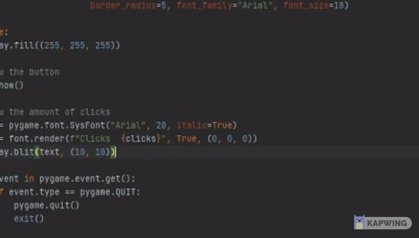

# Pygame Button

Python pygame module for creating simple buttons. This module requires at least `pygame 2.0.0` Newer version is recommended!

---

## Requirements
- #### Python 3
    - [https://www.python.org/](https://www.python.org/)
- #### pygame < 2.0.0
    - To install the latest version of pygame, find the corresponding command for your OS below and run the command in your terminal
- #### pygame_button
    - Not published yet

| OS                 | Command                                   |
| :---               | :----                                     |
| Windows            | `py -m pip install -U pygame --user`      |
| Mac OS             | `python3 -m pip install -U pygame --user` |
| Debian/Ubuntu/Mint | `sudo apt-get install python3-pygame`     |
| Fedora/Red hat     | `sudo yum install python3-pygame`         |
| OpenSUSE           | `sudo zypper install python3-pygame`      |
| Arch/Manjaro       | `sudo pamac install python-pygame`        |

---

## Usage
[example.py](example.py)

```
import pygame
from pygame_button import button

pygame.init()

# Create the button
btn = button(surface, (r, g, b), "text", (x, y, width, height), lambda: command, [optional argument(s)])

while True:
    # Show the button
    btn.show()
```

<p align="center">
  
</p>

### Optional arguments:
- #### Borders
    - (integer) border_radius
    - (integer) border_top_left_radius
    - (integer) border_top_right_radius
    - (integer) border_bottom_left_radius
    - (integer) border_bottom_right_radius

- #### Font
    - (pygame Font/SysFont) font
    - (string) font_family
    - (integer) font_size

- #### Styling
    - (list) text_color
    - (list) hover_color
    - (boolean) bold
    - (boolean) italic
    
---
